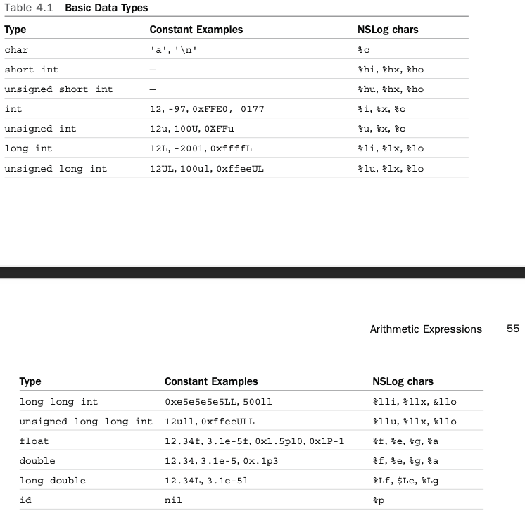

#  Exercises

> **Exercise 1:** Which of the following are invalid constants? Why?



- `123.456`: valid float
- `0x10.5`: *invalid*: hexadecimal floating constants require an exponent
- `0X0G1`: *invalid*: `G1` is an invalid suffix
- `0001`: valid integer
- `0xFFFF`: valid integer
- `123L`: valid long integer
- `0Xab05`: valid integer
- `0L`: valid long integer
- `-597.25`: valid float
- `123.5e2`: valid float
- `.0001`: valid float
- `+12`: valid integer
- `98.6F`: valid float
- `98.7U`: *invalid*: `U` is an invalid suffix
- `17777s`: *invalid*: `s` is an invalid suffix
- `0996`: *invalid*: `9` is an invalid octal constant
- `-12E-12`: valid float
- `07777`: valid integer
- `1234uL`: valid unsigned long integer
- `1.2Fe-7`: *invalid*: `Fe-7` is an invalid suffix
- `15,000`: *invalid*: commas aren't valid in constants
- `1.234L`: valid long float
- `197u`: valid integer
- `100U`: valid integer
- `0XABCEDFL`: valid long integer
- `0xabcu`: valid unsigned int
- `+123`: valid integer

> **Exercise 2:** Write a program that converts from degrees Fahrenheit (F) to degrees Celsius (C) using the following formula: `C = (F - 32) / 1.8`.

See [DegreesConverter](./degrees_converter/DegreesConverter.m)

> **Exercise 3:** What would you expect from the following program?

```objc
#import <Foundation/Foundation.h> int main (int argc, char * argv[]) {
@autoreleasepool { char c, d;
c = 'd';
d = c;
NSLog (@"d = %c", d);
}
return 0; }
```
Answer:

d d

> **Exercise 4:** Write a program to evaluate the polynomial `3x^3 - 5x^2 + 6` for `x = 2.55`;

See [PolynomialEvaluation](./polynomial_evaluation/PolynomialEvaluation.m)

> **Exercise 5:** Write a program that evaluates the following expression and displays the results:
> - `(3.31 x 10^-8 + 2.01 x 10^-7) / (7.16 x 10^-6 + 2.01 x 10^-8)`
> Write a program that evaluates the following expression and displays the results. (Remember to use exponential format to display the result.) (3.31 x 10^-8 + 2.01 x 10^-7) / (7.16 x 10^-6 + 2.01 x 10^-8)

See [ExpressionEvaluation](./expression_evaluation/ExpressionEvaluation.m)

> **Exercise 6:** *Complex* number are numbers that contain two components: 
>
> 1. a *real* part,
> 2. and an *imaginary* part.
>
> If `a` is the real component and `b` is the imaginary component, this notation is used to represent the number: `a + bi`.
>
> Write an Objective-C program that defines a new class called `Complex`. Following the paradigm established for the `Fraction` class, define the following methods for your new class and write a test program to test your new class and methods.

```objc
-(void) setReal: (double) a;
-(void) setImaginary: (double) b; -(void) print; // display as a + bi 
-(double) real;
-(double) imaginary;
```

See [Complex](./complex/Complex.m)

> **Exercise 7:** Suppose you are developing a library of routines to manipulate graphical objects. Start by defining a new class called `Rectangle`. For now, just keep track of the rectangle's width and height. Develop methods to set the rectangle's width and height, retrieve these values, and calculate the rectangle's area and perimeter. Assume that these rectangle objects describe rectangles on an internal grid, such as a computer screen. In that case, assume the width and height are integer values.
>
> Here is the `@interface` sectio of the `Rectangle` class. Write the `@implementation` section and a test program to test your new class and methods.

```objc
@interface Rectangle: NSObject
-(void) setWidth: (int) w;
-(void) setHeight: (int) h;
-(int) width;
-(int) height;
-(int) area;
-(int) perimeter;
@end
```

See [Rectangle](./rectangle/Rectangle.m)

> **Exercise 8:** The `add:`, `subtract:`, `multiply:`, and `divide:` methods from **program 4.6** do not return a value. Modify these methods to return the value of the accumulator after the computation is performed. Test the new methods.

See [Calculator](./calculator/Calculator.m)

> **Exercise 9:** Add the following methods to the `Calculator` class and test them:

```objc
-(double) changeSign; // change sign of accumulator 
-(double) reciprocal; // 1/accumulator
-(double) xSquared; // accumulator squared
```

See [Calculator](./calculator/Calculator.m)

> **Exercise 10:** Add a memory capability to the `Calculator` class. Implement the following method declarations and test them:

```objc
-(double) memoryClear;
-(double) memoryStore;
-(double) memoryRecall;
-(double) memoryAdd: (double) value; -(double) memorySubtract: (double) value;
// clear memory
// set memory to accumulator // set accumulator to memory // add value into memory
// subtract value from memory
```
The last two methods set the accumulator and perform the indicated operation on memory. Have all the methods return the value of the accumulator.

See [Calculator](./calculator/Calculator.m)
